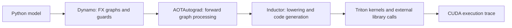

# PyTorch Compiler & LLM Inference Performance Analysis

A benchmark and graph-analysis suite for `torch.compile`, covering controlled
tensor workloads, transformer model transformations, and Qwen2.5-0.5B-Instruct
prefill and KV-cached decode. The project evaluates compiler-generated fusion,
graph capture, runtime overhead, numerical agreement, and shape-dependent
performance.



The workloads use inference mode. Generated kernels are produced by Inductor;
projection packing is an explicit model transformation implemented in the suite.

## Measurements

The [results table](artifacts/benchmark_results/results.md) includes raw timing
samples, correctness checks, kernel counts, and shape coverage.
[Execution metadata](artifacts/benchmark_results/evidence.json) records measured
source hashes, hardware/software details, and portable replay commands.

Compiler and Qwen measurements below use an RTX 5050 Laptop GPU and PyTorch
`2.12.0+cu130`. Timing is synchronized and collected outside profiler capture.

| Workload | Observation | Measurement scope |
|---|---|---|
| FP32 pointwise reduction `[1024,4096]` | 2.07–2.12× steady-state ratio | Three fresh processes; 100 samples per variant |
| Pointwise first-call cost | 1.71–4.69 s; 14,072–38,625 estimated break-even calls | First call includes capture, compilation, allocation, and execution |
| FP16 gated MLP `[4,128,768]` | 13.1–16.2% higher compiled latency | 4,718,592 parameters; three fresh-process trials |
| Gated MLP generated execution | 5 → 4 GPU kernels; 278.01 → 315.07 µs | Separate 500-sample runtime decomposition |
| Tensor-dependent control flow | 3 FX regions → 1 graph with `torch.cond` | Both predicates and six Inductor validation cases |
| Qwen FP32, 44-token prefill | 1,385 → 482 GPU kernels; 30.19–32.26 → 26.37–26.39 ms | Two trials; batch one; CUDA Graphs disabled |
| Qwen FP32, eight decode steps | 8,968 → 3,280 GPU kernels; 97.68–97.88 → 66.80–67.28 ms | Same reference tokens and a fresh KV cache per request |

These ranges describe measured trial variation, not confidence intervals.
Smaller pointwise and batch-one MLP workloads also regress. Fewer kernels do not
guarantee lower latency; see [MLP runtime analysis](docs/mlp_regression.md).

### Qwen configurations and correctness

The sweep covers prompt lengths 32, 44, 128, and 512, with 8- and 32-step
continuations. Eager and compiled paths use identical weights, prompt IDs, and
replayed reference tokens. Prefill and decode are measured separately.

- `no-cudagraphs` sets `triton.cudagraphs=False` to isolate compiler code
  generation and ordinary dispatch.
- `reduce-overhead` requests CUDA Graph support and counts actual replay calls.
  Logits and DynamicCache K/V are cloned outside compilation for both variants
  to preserve output ownership. Those copies are included in the measured phase.

FP32 uses `atol=rtol=1e-3` with TF32 disabled and passed every tested case in both
configurations. BF16 uses `atol=rtol=2e-2`, preserves intermediate precision casts,
and pins math attention equally for both variants. All 48 BF16 cases failed the
logit gate; eight also had greedy-token disagreement. Rejected cases have no
accepted steady-state timing or launch-count comparison. See the
[numerical results](artifacts/benchmark_results/results.md#numerical-rejections).

Decode excludes cache-prefill setup, token selection, tokenization, and text
decoding. These are model-forward measurements, not complete serving TTFT/TPOT.
The [Qwen trace analysis](docs/qwen_trace_analysis.md) distinguishes normalization
and SiLU/multiply fusion from attention-backend changes.

### Transformer optimization studies

The suite also evaluates reversible projection packing, compilation boundaries,
RMSNorm lowering, and TorchAO quantization on a minimal pre-norm transformer
containing RMSNorm, causal attention, residual connections, and a gated MLP.

| Study | Measured result | Evidence |
|---|---|---|
| Gated-MLP gate/up packing | 3 → 2 external GEMMs; 1.04–1.17× versus unpacked compiled execution | [Analysis](artifacts/mlp_projection_packing/summary.md) |
| Transformer Q/K/V and gate/up packing | 7 → 4 external GEMMs; 12 → 9 profiled CUDA kernels | [Analysis](artifacts/transformer_optimization/summary.md) |
| Whole-block versus regional compilation | About 1.4× faster for the two batch-one shapes; tied at `[4,128,768]` | [Boundary comparison](artifacts/transformer_optimization/summary.md#compilation-boundary) |
| Dynamic INT8 and FP8 | About 2× lower linear-weight storage; 1.38× and 1.50× at `[4,128,768]` versus compiled BF16 | [Quality and latency](artifacts/transformer_quantization/summary.md) |

Packing ratios compare compiled variants, not a guaranteed win over eager.
Quantization did not improve the sequence-length-one case. Each study records
its own environment and baseline; results are not hardware-independent claims.

## Installation

Python 3.11+ and a PyTorch build appropriate for the target CPU or CUDA device
are required. Qwen and generated CUDA-kernel analysis require a CUDA GPU.

```bash
python -m venv .venv
source .venv/bin/activate
# Install PyTorch for the target platform first.
pip install -e ".[dev,llm]"
python -m pytest
```

For quantization, install the optional dependency:

```bash
pip install -e ".[quantization]"
```

Cache the pinned Qwen revision once:

```bash
python -c 'from huggingface_hub import snapshot_download; snapshot_download("Qwen/Qwen2.5-0.5B-Instruct", revision="7ae557604adf67be50417f59c2c2f167def9a775")'
```

## Reproduce the benchmark suite

```bash
python -m compilelab.experiments \
  --suite all --trials 3 --qwen-trials 2 \
  --prompt-lengths 32,44,128,512 --decode-steps 8,32 \
  --output-dir artifacts/benchmark_runs

python -m compilelab.evidence \
  --run-dir artifacts/benchmark_runs \
  --output-dir artifacts/benchmark_results
```

Workers execute serially in fresh processes with private Inductor and Triton
caches. The harness records exact invocation arguments, raw samples, source
hashes, failures, and GPU clock/power snapshots without changing device settings.
Large traces, worker source copies, and logs remain in the ignored run directory;
the exporter retains results, representative graphs/wrappers, and replay metadata.

Use `--suite micro` or `--suite qwen` for a subset. `--resume` skips completed
workers in the specified run directory. BF16 accuracy coverage uses
`--continue-on-mismatch`; it records `study_status="rejected"` and skips rejected
performance measurements. Unexpected runtime errors exit nonzero.

## Individual workflows

Pointwise benchmark and strict control-flow capture:

```bash
python -m compilelab --device cuda --shape 1024,4096 \
  --warmup 20 --iterations 100 --output-dir artifacts/pointwise_run

python -m compilelab.graph_break --device cpu \
  --output-dir artifacts/control_flow_run
```

Gated-MLP generated code and runtime decomposition:

```bash
python -m compilelab.codegen --dtype float16 \
  --batch-size 4 --sequence-length 128 --model-dim 768 --hidden-dim 2048 \
  --warmup 50 --iterations 500 --profile-iterations 20 \
  --output-dir artifacts/mlp_codegen_run
```

Qwen prefill and KV-cached decode:

```bash
python -m compilelab.qwen --dtype float32 --configuration no-cudagraphs \
  --prompt-lengths 44 --decode-steps 8 --warmup 3 --iterations 10 \
  --output-dir artifacts/qwen_run
```

Eager and compiled Torch Profiler traces:

```bash
python -m compilelab.profiler_trace --workload gated-mlp --device cuda \
  --dtype float16 --batch-size 4 --sequence-length 128 \
  --model-dim 768 --hidden-dim 2048 --warmup 20 --iterations 10 \
  --output-dir artifacts/profiler_run
```

Open the eager/compiled JSON traces in Perfetto. Compilation and warmup finish
before capture. `profile_metadata.json` records numerical checks, kernel names,
and counts; operator tables contain CPU/CUDA aggregates. Profiler durations
include instrumentation overhead and are not the benchmark latency result.
Use `--variant eager` or `--variant compiled` to capture one path, and
`--no-profile-memory` for lighter instrumentation.

Dynamic-shape capture and model optimization:

```bash
python -m compilelab.dynamic_shapes --sequence-lengths 32,64,128,32,64 \
  --output-dir artifacts/shape_run

python -m compilelab.projection_packing --cases 1x1,1x128,4x128 \
  --output-dir artifacts/packing_run

python -m compilelab.transformer_optimization --cases 1x1,1x128,4x128 \
  --output-dir artifacts/transformer_run

python -m compilelab.quantization --cases 1x1,1x128,4x128 \
  --output-dir artifacts/quantization_run
```

## Repository structure

```text
compilelab/
  workload.py                 Pointwise, gated-MLP, and packed-MLP models
  benchmark.py                Correctness, latency samples, and amortization
  graph_break.py              Python branching versus torch.cond capture
  codegen.py                  Generated wrappers and runtime decomposition
  profiler_trace.py           Eager/compiled Chrome trace export
  trace_analysis.py           GPU kernels, intervals, and graph-replay counts
  dynamic_shapes.py           Guards and shape specialization
  qwen.py                     Fixed-token prefill and KV-cached decode
  experiments.py              Fresh-process benchmark harness
  evidence.py                 Result tables and portable replay metadata
  projection_packing.py       Reversible gate/up projection conversion
  transformer.py              Minimal and projection-packed transformer models
  transformer_optimization.py Compilation boundaries and mode selection
  quantization.py             TorchAO INT8/FP8 comparisons
docs/                         Methodology and measured performance analysis
tests/                        Model, capture, trace, and export checks
artifacts/benchmark_results/   Curated compiler and Qwen measurements
```

See [methodology and code walkthrough](docs/inference_performance.md),
[MLP regression analysis](docs/mlp_regression.md), and
[Qwen trace analysis](docs/qwen_trace_analysis.md).

## Measurement limits

Clock/power settings are uncontrolled and the laptop GPU drives the display.
Inference correctness checks cover tested logits or block outputs, not task-level
model quality. Kernel counts exclude annotations, copies, and memsets. Trace
activity coverage is not hardware occupancy or measured memory bandwidth.
The suite does not implement production serving, continuous batching,
distributed inference, training optimization, or custom-authored fusion kernels.
